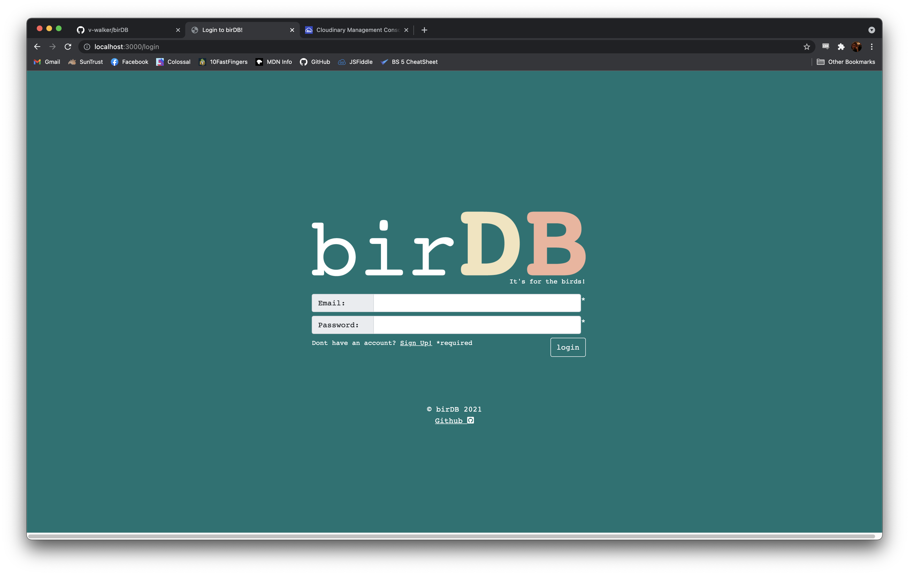
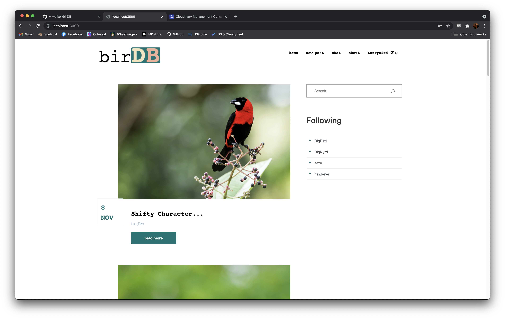
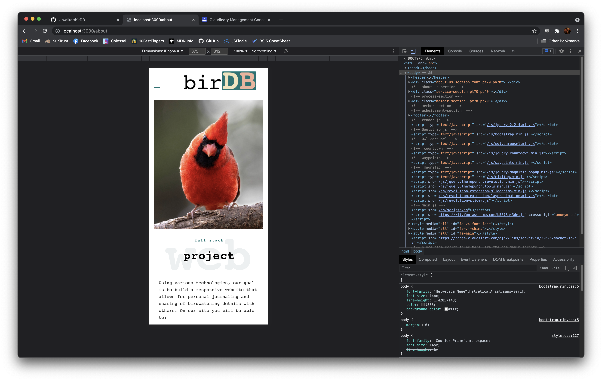

# birDB

***[link to deployed site]()***

A birdwatching journal and social media site. 
- View recent bird sightings.
- Add field notes and images to your personal birdwatching journal.
- Share your sightings with others.
- Chat with others who have similar interests!



---
## Tech Stack
- Languages:
    - Javascript
    - Node.js
    - HTML
    - CSS
    - SQL
- Technologies/Libraries
    - EJS
    - Bootstrap
    - AJAX
    - Passport
    - Bcryptjs
    - Sequelize
    - PostgreSQL
    - Beekeeper
    - Socket.io
    - Git
    - Github

---

## MVP
- Build a responsive website that allows for personal journaling and sharing of birdwatching details with others. 
- Use PostgreSQL and multiple database tables for data management.
- Use Cloudinary API for image upload and storage.
- Use EJS and partials for templating.
- Implement chat functionality using socket.io.
- Implement search functionality to search posts by common name and scientific name of birds.



---
## Stretch Goals
- Implement search functionality for querying usernames and locations.
- Implement admin dashboard.
- Use GoogleMaps or another mapping API to display location data.
- Add in travel options for planning birdwatching outings.

---
## Code Snippets

```
const express = require("express");
const router = express.Router()
const gatekeeper = require('../auth');
const formidable = require('formidable');
const cloudinary = require("cloudinary");
const db = require('../models');
const path = require("path")
const fs = require("fs")
require('dotenv').config()

cloudinary.config({
    cloud_name: process.env.CLOUD_NAME,
    api_key: process.env.API_KEY,
    api_secret: process.env.API_SECRET
});

router.get("/create", gatekeeper, async (req, res) => {

    let record = await db.users.findByPk(req.user.id)
    res.render("create",
    {
        username: record.username,
        userID: record.id
    }
    )
})

router.post('/create', gatekeeper, async (req, res, next) => {
    let userID = req.user.id
    const form = new formidable.IncomingForm();
    let uploadFolder = path.join(__dirname, "../public", "files")
    form.uploadDir = uploadFolder
    form.parse(req, async (err, fields, files) => {
        if (err) {
            next()
            return
        }
         precipitation: fields.precip, temperature: fields.temp, cloudCover: fields.cloud, observation: fields.observation, likes: "0", userID: userID, imgURL: "www.bird.com"})
        cloudinary.uploader.upload(files.upload.filepath, async result => {
            await db.posts.create({title: fields.title, commonName: fields.common, scientificName: fields.scientific, location: fields.location, precipitation: fields.precip, temperature: fields.temp, cloudCover: fields.cloud, observation: fields.observation, likes: "0", userID: userID, imgURL: result.secure_url})
        })
        fs.unlinkSync(files.upload.filepath);
    });
    res.redirect("/")
});

module.exports = router
```

---
## Screenshots



---
## Developers

Victoria Walker: 

- https://github.com/v-walker
- Database architecture
- Backend route handling and functionality for index, post, and search
- Frontend integration of search

Hunter Hutchisson:

- https://github.com/hunterhutchisson
- Comment functionality - add, edit and delete comments
- Front end site population for multiple and single posts

Ryan Donald:

- https://github.com/ryanthomasdonald
- Logo Design
- Cloudinary/Formidable Integration

Andrew Hatch:

- https://github.com/AMHatch
- Login, registration, about, and chat pages
- Authentication

---
## Test user/login information for demonstration

- email: *test@email.com*
- password: *test*